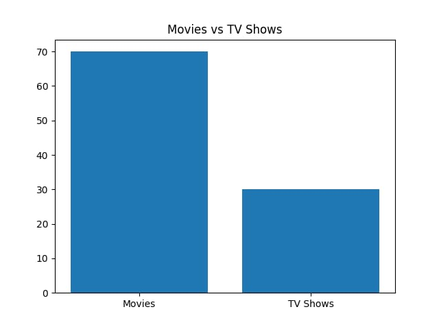

# Netflix Data Analysis

## 📌 Project Overview
This project analyzes Netflix dataset to understand content distribution and trends.

## 🛠️ Tools Used
- Python
- Pandas
- Matplotlib
- Seaborn

## 📊 What I Did
- Loaded and cleaned Netflix dataset
- Analyzed Movies vs TV Shows distribution
- Identified top countries producing content
- Analyzed content growth over years

## 📈 Key Insights
- Movies are more compared to TV Shows
- USA produces most Netflix content
- Content increased rapidly after 2015

## 📷 Output

## 🚀 Conclusion
This project helped me understand data analysis and visualization using Python.
